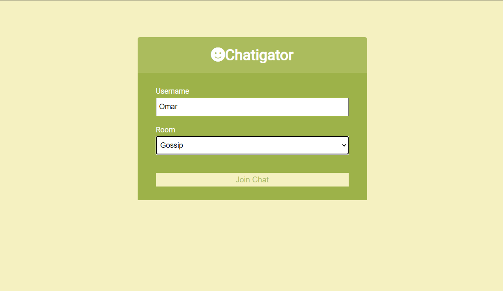

# Chatigator
A chat app where users can enter chat rooms and exchange messages real time. 

## Tech stack
  1. ExpressJS
  2. NodeJS
  3. Vanilla Javascript
  4. Custom CSS
  5. Socket.io

### Dekstop View 

### Mobile View

## Temporary warning
 
 The site works fine on any local machine. But it had issues while "npm run build" thus is temporary unavailable on the hosted link. The issues will be fixed soon. Thanks for your patience!
